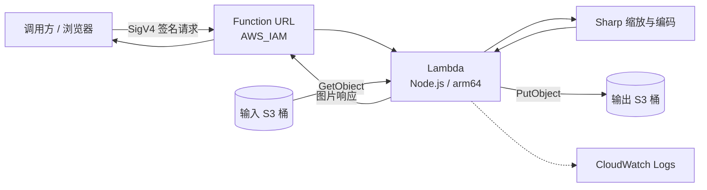

# s3-image-resize-lambda

> ⚠️ 本仓库仅用于参考与演示，不是生产图片服务方案。  
> 部署会产生 AWS 费用；请使用测试数据、最小权限，并在体验后清理资源。

一个使用 AWS Lambda 和 Sharp 实现 **S3 输入 → 图片缩放 → S3 输出**的示例，通过启用 `AWS_IAM` 认证的 Function URL 调用。

## 何时不适合本仓库

如果你需要面向公网的图片分发、CloudFront 集成、成熟的缓存策略或更完整的运维能力，优先评估 AWS Dynamic Image Transformation（DIT）：

- [AWS 方案介绍](https://aws.amazon.com/solutions/implementations/dynamic-image-transformation-for-amazon-cloudfront/)
- [开源实现](https://github.com/aws-solutions/dynamic-image-transformation-for-amazon-cloudfront)

本仓库适合学习处理链路、验证 Sharp 打包方式，以及作为团队自行扩展的起点。

## 架构图



- 输入对象必须已经存在于输入桶中；请求不接受任意远程图片地址。
- 缩放结果写入输出桶，Function URL 返回处理后的图片。
- 两个 S3 桶保持私有，不需要开启静态网站托管。
- 浏览器使用预签名 Function URL，不等于把 S3 对象设为公开。

## 目录结构

```text
s3-image-resize-lambda/
├── index.mjs                 # Lambda 入口与图片处理逻辑
├── package.json              # Sharp 等运行时依赖
├── package-lock.json         # 锁定依赖版本
├── scripts/
│   ├── deploy.sh             # 脚本部署入口
│   ├── invoke-python.py      # 签名调用与预签名 URL 示例
│   └── invoke-nodejs.mjs      # Node.js 调用示例
├── .deploy/                  # 手动部署生成的临时文件
├── LICENSE
└── README.md
```

以下命令均在仓库根目录执行；`.deploy/` 不应提交到版本控制。

调用脚本的完整参数以各脚本的 `--help` 为准。

## 防护层

| 层级 | 本示例的做法 / 边界 |
| --- | --- |
| 请求认证 | Function URL 使用 `AWS_IAM`，不提供匿名入口 |
| 调用权限 | 调用方同时获得两项 Lambda 调用权限 |
| 数据访问 | 执行角色仅访问指定输入、输出桶 |
| 桶公开访问 | 启用 S3 Block Public Access |
| 并发 | Reserved Concurrency 为 `5`，超出时限流 |
| 执行时间 | Lambda timeout 为 `29` 秒 |
| 资源使用 | 内存为 `1769 MB`；不代表可以安全处理任意图片 |
| 应用输入 | 上线前检查尺寸、源文件大小、像素数及编码格式限制 |

并发和超时只能限制部分资源消耗，不能代替费用告警、业务配额或恶意图片防护。

## 快速开始

准备好 AWS 凭证、Node.js、npm、AWS CLI 和 `zip`，并确认部署身份有创建相关资源的权限。

```bash
export AWS_REGION=ap-northeast-1
export INPUT_BUCKET=replace-with-globally-unique-input-bucket
export OUTPUT_BUCKET=replace-with-globally-unique-output-bucket
bash scripts/deploy.sh
```

脚本部署与下方手动部署二选一；调用脚本前仍需给调用方授予 IAM 权限。

## 手动部署

以下流程使用同一 AWS 账户内的资源；跨账户调用还需要配置相应的资源策略。

### 1. 设置部署变量

选择支持目标运行时的区域，并把 `CALLER_ROLE_NAME` 改为已有的调用方角色名；桶名在 AWS 分区内全球唯一，时间戳后缀仅用于降低重名概率。

```bash
export AWS_REGION=ap-northeast-1
export AWS_DEFAULT_REGION="$AWS_REGION"
export ACCOUNT_ID="$(aws sts get-caller-identity --query Account --output text)"
export SUFFIX="$(date +%s)"
export FUNCTION_NAME=s3-image-resize-lambda
export ROLE_NAME="${FUNCTION_NAME}-execution"
export CALLER_ROLE_NAME=your-invoker-role
export INPUT_BUCKET="s3-resize-in-${ACCOUNT_ID}-${SUFFIX}"
export OUTPUT_BUCKET="s3-resize-out-${ACCOUNT_ID}-${SUFFIX}"
export ROLE_ARN="arn:aws:iam::${ACCOUNT_ID}:role/${ROLE_NAME}"
export FUNCTION_ARN="arn:aws:lambda:${AWS_REGION}:${ACCOUNT_ID}:function:${FUNCTION_NAME}"
```

验证：确认账户、区域和调用方角色正确，两个桶名仅包含 S3 支持的字符。

### 2. 创建两个私有 S3 桶

两个桶与 Lambda 放在同一区域；`us-east-1` 创建桶时不能传 `LocationConstraint`，其他区域需要显式指定。

```bash
for BUCKET in "$INPUT_BUCKET" "$OUTPUT_BUCKET"; do
  if [ "$AWS_REGION" = "us-east-1" ]; then
    aws s3api create-bucket --bucket "$BUCKET"
  else
    aws s3api create-bucket \
      --bucket "$BUCKET" \
      --create-bucket-configuration LocationConstraint="$AWS_REGION"
  fi
  aws s3api put-public-access-block \
    --bucket "$BUCKET" \
    --public-access-block-configuration \
      BlockPublicAcls=true,IgnorePublicAcls=true,BlockPublicPolicy=true,RestrictPublicBuckets=true
done
```

验证：S3 控制台中可以看到两个桶，且 Block Public Access 的四个选项全部启用。

### 3. 安装依赖并打包

部署目标是 Linux arm64，Sharp 必须带上 `--platform=linux --arch=arm64 --libc=glibc --include=optional`；不要直接打包本机已有的 `node_modules`。

```bash
mkdir -p .deploy
rm -rf node_modules
npm ci --omit=dev \
  --platform=linux --arch=arm64 --libc=glibc --include=optional
rm -f .deploy/function.zip
zip -qr .deploy/function.zip \
  index.mjs package.json package-lock.json node_modules
unzip -l .deploy/function.zip | grep 'sharp-linux-arm64'
```

验证：压缩包根目录包含 `index.mjs`，并能找到 Sharp 的 Linux arm64 可选依赖。

注意：若锁文件缺少目标平台依赖，应修正并提交锁文件，而不是忽略安装错误。

### 4. 创建 Lambda 执行角色

信任策略允许 Lambda 承担该角色；托管策略仅用于基础日志写入，S3 权限在下一步单独授予。

```bash
cat > .deploy/trust.json <<'JSON'
{
  "Version": "2012-10-17",
  "Statement": [
    {
      "Effect": "Allow",
      "Principal": {
        "Service": "lambda.amazonaws.com"
      },
      "Action": "sts:AssumeRole"
    }
  ]
}
JSON
aws iam create-role \
  --role-name "$ROLE_NAME" \
  --assume-role-policy-document file://.deploy/trust.json
aws iam attach-role-policy \
  --role-name "$ROLE_NAME" \
  --policy-arn arn:aws:iam::aws:policy/service-role/AWSLambdaBasicExecutionRole
```

验证：`create-role` 返回的 `Role.Arn` 与 `$ROLE_ARN` 一致。

### 5. 授予执行角色 S3 权限

输入桶只读，输出桶允许读取已有结果和写入新结果；`HeadObject` 使用 `s3:GetObject` 授权，`s3:HeadObject` 不是有效 IAM action。

```bash
cat > .deploy/s3-policy.json <<JSON
{
  "Version": "2012-10-17",
  "Statement": [
    {
      "Sid": "ReadInput",
      "Effect": "Allow",
      "Action": "s3:GetObject",
      "Resource": "arn:aws:s3:::${INPUT_BUCKET}/*"
    },
    {
      "Sid": "ReadWriteOutput",
      "Effect": "Allow",
      "Action": [
        "s3:GetObject",
        "s3:PutObject"
      ],
      "Resource": "arn:aws:s3:::${OUTPUT_BUCKET}/*"
    }
  ]
}
JSON
aws iam put-role-policy \
  --role-name "$ROLE_NAME" \
  --policy-name ImageBuckets \
  --policy-document file://.deploy/s3-policy.json
```

验证：角色的 `ImageBuckets` 内联策略仅引用这两个桶，没有桶列表或删除权限。

注意：使用自定义 KMS 密钥时，还需补充匹配的 KMS 权限与密钥策略。

### 6. 创建 Lambda 函数

等待 IAM 传播约 10–15 秒后创建函数，使用 `nodejs20.x`、`arm64`、`1769 MB` 内存和 `29` 秒超时；环境变量指定输入与输出桶。

```bash
sleep 15
aws lambda create-function \
  --function-name "$FUNCTION_NAME" \
  --runtime nodejs20.x \
  --architectures arm64 \
  --handler index.handler \
  --role "$ROLE_ARN" \
  --memory-size 1769 \
  --timeout 29 \
  --environment "Variables={INPUT_BUCKET=${INPUT_BUCKET},OUTPUT_BUCKET=${OUTPUT_BUCKET}}" \
  --zip-file fileb://.deploy/function.zip
aws lambda wait function-active-v2 \
  --function-name "$FUNCTION_NAME"
```

验证：函数进入 `Active` 状态，控制台显示的运行时、架构、内存和超时与上述参数一致。

注意：若仍提示角色无法被承担，稍后重试；实际部署前也应检查该运行时的 AWS 支持状态。

### 7. 限制函数并发

将 Reserved Concurrency 设为 `5`，控制该函数的并行执行数量；这不是每秒请求数限制。

```bash
aws lambda put-function-concurrency \
  --function-name "$FUNCTION_NAME" \
  --reserved-concurrent-executions 5
```

验证：返回结果中的 `ReservedConcurrentExecutions` 为 `5`。

### 8. 创建 IAM 认证的 Function URL

必须使用 `AuthType AWS_IAM`，不要为了排查调用问题切换为匿名认证；默认不配置跨域读取权限。

```bash
export FUNCTION_URL="$(aws lambda create-function-url-config \
  --function-name "$FUNCTION_NAME" \
  --auth-type AWS_IAM \
  --query FunctionUrl \
  --output text)"
aws lambda get-function-url-config \
  --function-name "$FUNCTION_NAME" \
  --query '{URL:FunctionUrl,Auth:AuthType}'
```

验证：返回有效的 HTTPS 地址，且 `Auth` 为 `AWS_IAM`。

### 9. 授予调用方权限

给调用方角色同时授予 `lambda:InvokeFunctionUrl` 和 `lambda:InvokeFunction`，并把后者限制为经 Function URL 调用；不要把调用方角色与 Lambda 执行角色混用。

```bash
cat > .deploy/invoke-policy.json <<JSON
{
  "Version": "2012-10-17",
  "Statement": [
    {
      "Effect": "Allow",
      "Action": "lambda:InvokeFunctionUrl",
      "Resource": "${FUNCTION_ARN}",
      "Condition": {
        "StringEquals": {
          "lambda:FunctionUrlAuthType": "AWS_IAM"
        }
      }
    },
    {
      "Effect": "Allow",
      "Action": "lambda:InvokeFunction",
      "Resource": "${FUNCTION_ARN}",
      "Condition": {
        "Bool": {
          "lambda:InvokedViaFunctionUrl": "true"
        }
      }
    }
  ]
}
JSON
aws iam put-role-policy \
  --role-name "$CALLER_ROLE_NAME" \
  --policy-name InvokeImageResize \
  --policy-document file://.deploy/invoke-policy.json
sleep 15
```

验证：使用该角色的凭证调用时，两项操作都能通过 IAM 授权，且没有被权限边界或组织策略拒绝。

### 10. 上传图片并调用

先准备本地 `sample.jpg`，上传使用具有输入桶写入权限的部署身份，调用使用上一步角色对应的 AWS profile；运行 Python 示例前安装其依赖。

```bash
aws s3 cp ./sample.jpg "s3://${INPUT_BUCKET}/examples/sample.jpg"
python3 -m pip install boto3 requests
AWS_PROFILE=your-invoker-profile python3 scripts/invoke-python.py \
  --url "$FUNCTION_URL" \
  --key examples/sample.jpg \
  --width 320 \
  --format webp
aws s3 ls "s3://${OUTPUT_BUCKET}/" --recursive
```

验证：调用返回成功的图片响应，输出桶出现处理结果，图片宽度符合请求及实现中的缩放规则。

## 请求参数

通过 Function URL 的查询字符串传入处理参数，使用 `GET` 请求。

| 参数 | 类型 | 说明 |
| --- | --- | --- |
| `key` | 字符串 | 必填，输入桶中的完整对象 key，大小写敏感 |
| `width` | 正整数 | 目标宽度，单位为像素 |
| `height` | 正整数 | 目标高度，单位为像素 |
| `fit` | 字符串 | Sharp 适配方式，例如 `inside`、`cover`、`contain` |
| `format` | 字符串 | 输出格式，例如 `jpeg`、`png`、`webp` |
| `quality` | 整数 | 编码质量；有效范围及效果取决于输出编码器 |

- 缩放请求至少指定 `width` 或 `height`；只指定一个维度时通常按比例缩放。
- 默认值、格式白名单、最大尺寸及是否允许放大，以 `index.mjs` 的参数校验为准。
- 输入桶由环境变量固定，不通过请求参数指定。
- key 中的空格、中文、`+` 等字符必须正确编码；避免先手动编码再被签名库重复编码。
- 所有处理参数必须在签名前加入 URL，签名后不要修改参数或路径。
- 输出对象命名和覆盖行为以实现为准，不应依赖未经确认的缓存语义。

## 响应头

| 响应头 | 说明 |
| --- | --- |
| `Content-Type` | 成功时应与实际图片格式一致，例如 `image/webp` |
| `Cache-Control` | 以处理函数实际返回值为准；私有图片不应默认进入共享缓存 |
| `x-amzn-RequestId` | AWS 返回的请求标识，可辅助关联调用与日志 |
| `Access-Control-Allow-Origin` | 仅在配置匹配的 Function URL CORS 规则时返回 |

Function URL 的二进制响应需要正确设置 `isBase64Encoded`；浏览器收到的应是图片字节，而不是 Base64 文本。

错误响应不应按图片解码，先检查 HTTP 状态码和 `Content-Type`。

## 浏览器直接使用（presigned URL）

在可信服务端使用 Python `SigV4QueryAuth` 为 Function URL 生成预签名 URL，服务名为 `lambda`，区域与函数一致，最长有效期为 7 天（604800 秒）；临时凭证过期会使链接提前失效。签名前加入全部图片参数，签名身份必须拥有两项调用权限；链接可用于 ``，但持有者在有效期内均可使用，不应写入公开日志。跨域 `fetch` 或 Canvas 读取还需要适当的 CORS 配置，浏览器中不要存放长期 AWS 密钥。

完整示例代码见 `scripts/invoke-python.py`；Node.js 调用示例见 `scripts/invoke-nodejs.mjs`。

## 常见错误 FAQ

- **为什么返回 403？**  
  检查签名凭证、区域和系统时间，并确认调用方同时拥有两项 Lambda 调用权限；跨账户时还需检查资源策略。

- **为什么预签名链接提前失效？**  
  有效期不能超过签名凭证剩余寿命；临时会话过期、权限撤销或 URL 被修改都会导致失败。

- **为什么 Sharp 无法加载？**  
  通常是打包了本机平台依赖，或遗漏可选依赖；清理 `node_modules` 后按第 3 步重新安装并打包。

- **为什么 S3 返回 403 或找不到对象？**  
  检查桶名、key、大小写及编码；没有 `ListBucket` 权限时，不存在的对象也可能表现为 403。

- **为什么创建函数时提示角色不可用？**  
  检查信任策略中的 `lambda.amazonaws.com`，并等待 IAM 传播；10–15 秒是常见等待时间，不是保证。

- **为什么返回 429 或超时？**  
  检查是否达到并发 `5`、是否处理超大图片，以及解码或编码耗时；不要直接靠提高上限掩盖问题。

- **为什么链接能显示图片，但 `fetch` 或 Canvas 失败？**  
  图片展示与跨域读取规则不同；为实际来源配置 CORS，不要把关闭 IAM 认证当作解决办法。

## 下一步

- 补齐源文件大小、解码像素数、输出尺寸与格式限制，并加入恶意图片测试。
- 增加结构化日志、错误指标、费用告警和依赖更新流程，评估受支持的运行时。
- 按业务需要设计缓存键、源对象更新策略、生命周期规则；分发需求较强时评估 AWS DIT。
- 体验结束后清理资源；先对两个桶执行 `--dryrun`，确认范围后再实际删除对象。

```bash
aws s3 rm "s3://${INPUT_BUCKET}/" --recursive --dryrun
aws s3 rm "s3://${OUTPUT_BUCKET}/" --recursive --dryrun
```

确认桶内没有需要保留的数据后，执行以下核心清理命令：

```bash
aws lambda delete-function-url-config --function-name "$FUNCTION_NAME"
aws lambda delete-function --function-name "$FUNCTION_NAME"
aws s3 rm "s3://${INPUT_BUCKET}/" --recursive
aws s3 rm "s3://${OUTPUT_BUCKET}/" --recursive
aws s3 rb "s3://${INPUT_BUCKET}"
aws s3 rb "s3://${OUTPUT_BUCKET}"
```

仅删除本次创建的资源；随后移除示例 IAM 策略、执行角色和日志组，不要删除共享的调用方角色。
若启用了 S3 版本控制，还需单独处理历史版本与删除标记，普通递归删除不会清空它们。

## License

许可证条款以仓库根目录的 [LICENSE](LICENSE) 为准。